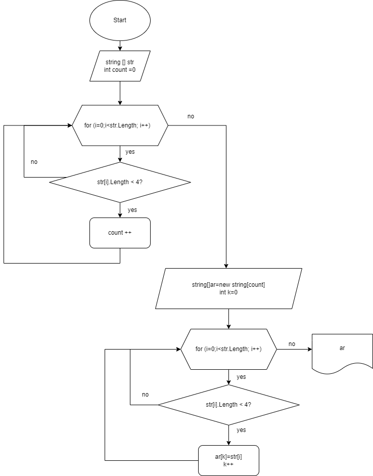

# Программа по созданию нового массива из существующего массива строк
По условию задачи нужно, чтобы в новом массиве остались только строки длиной менее 4 символов.
Для того чтобы проверить все элементы (строки) на количество символов мы используем цикл **for**, условие **if** и функцию **.Length**.
Подсчитав количество нужных нам элементов, мы узнаем таким образом **размер** нового массива. После этого инициализируем новый массив такого размера.
Вводим новую переменную для индекса нового массива и еще раз через цикл for и условие if находим все элементы исходного массива, удовлетворяющие условию, и присваиваем соответствующему элементу нового массива значение каждого такого элемента исходного массива.

